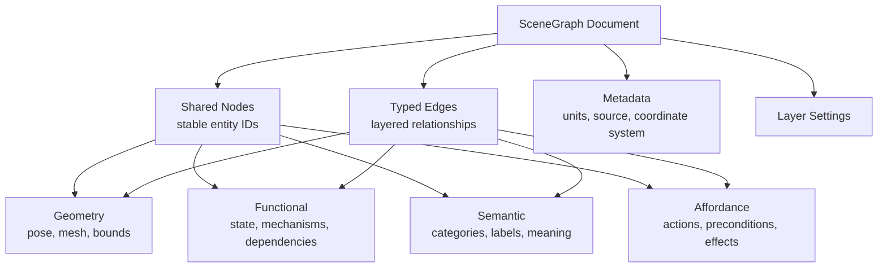

# SceneGraph

SceneGraph is a repository for discussing a unified scene graph schema.

The goal is to describe a scene not only as geometry, but also as a set of
meaningful relationships: what objects are, what they do, what they enable, and
how agents or systems can reason about them.

## Scope

This schema is organized around four connected graph views:

| Graph view | Purpose |
| --- | --- |
| Geometry graph | Spatial structure, transforms, meshes, bounds, containment, and attachment. |
| Functional graph | Components, mechanisms, state, dependencies, flows, and behaviors. |
| Semantic graph | Object identity, categories, attributes, labels, part-whole meaning, and context. |
| Affordance graph | Possible actions, preconditions, effects, actors, tools, and interaction targets. |

These views share stable node identifiers so that one physical object can be
described across multiple layers. For example, a door can have geometry, a
hinge function, the semantic category `door`, and affordances such as `open`,
`close`, and `lock`.

## Schema Sketch



## Repository Layout

```text
.
|-- README.md
|-- docs/
|   |-- code-generation.md
|   |-- design-principles.md
|   |-- graph-layers.md
|   |-- open-questions.md
|   |-- protobuf-geometry.md
|   |-- schema-overview.md
|   |-- usage-examples.md
|   `-- visualization.md
|-- examples/
|   |-- cpp/
|   |   |-- CMakeLists.txt
|   |   `-- build_room.cc
|   |-- csharp/
|   |   |-- Program.cs
|   |   `-- SceneGraph.Example.csproj
|   |-- python/
|   |   `-- build_room.py
|   `-- room.scenegraph.json
|-- .github/
|   `-- workflows/
|       `-- protobuf.yml
|-- proto/
|   `-- scenegraph.proto
|-- requirements-dev.txt
|-- schema/
|   `-- scenegraph.schema.json
`-- tools/
    `-- generate_protos.py
```

## Core Idea

A scene graph document is made of:

1. `metadata`: versioning, authorship, units, coordinate system, and source.
2. `nodes`: entities that can appear in one or more graph views.
3. `edges`: relationships between nodes, typed by graph layer.
4. `layers`: optional layer-specific indexes, defaults, and validation rules.
5. `extensions`: experimental fields for domain-specific use.

The schema should stay small at the core and allow domain-specific extensions
for robotics, simulation, digital twins, games, spatial AI, CAD, and embodied
agent planning.

For runtime use in C++, Python, and C#, the Protobuf contract in
[proto/scenegraph.proto](proto/scenegraph.proto) is the main target. Geometry is
typed there with frame-relative pose, quaternion rotation, bounds, primitives,
and mesh references, while functional, semantic, and affordance properties remain
flexible during early schema design.

## Status

This repository is an early proposal. The current files are intended to support
discussion, review, and iteration rather than define a frozen standard.

## Getting Started

Read:

1. [Design Principles](docs/design-principles.md)
2. [Graph Layers](docs/graph-layers.md)
3. [Schema Overview](docs/schema-overview.md)
4. [Visualization](docs/visualization.md)
5. [Protobuf Geometry](docs/protobuf-geometry.md)
6. [Code Generation](docs/code-generation.md)
7. [Usage Examples](docs/usage-examples.md)
8. [Open Questions](docs/open-questions.md)

Then compare the JSON schema in [schema/scenegraph.schema.json](schema/scenegraph.schema.json)
with the sample scene in [examples/room.scenegraph.json](examples/room.scenegraph.json).

For C++, Python, and C# runtime use, generate Protobuf bindings from
[proto/scenegraph.proto](proto/scenegraph.proto):

```powershell
python tools/generate_protos.py
```
