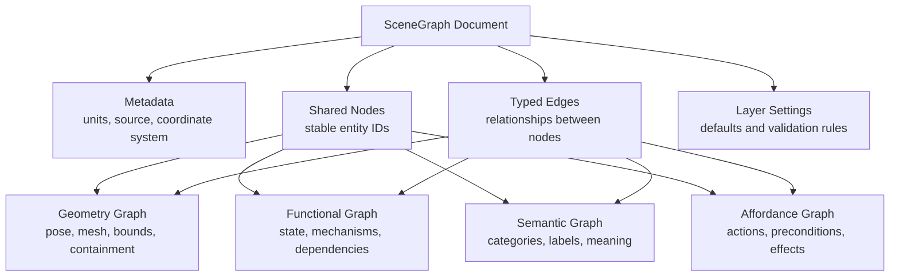
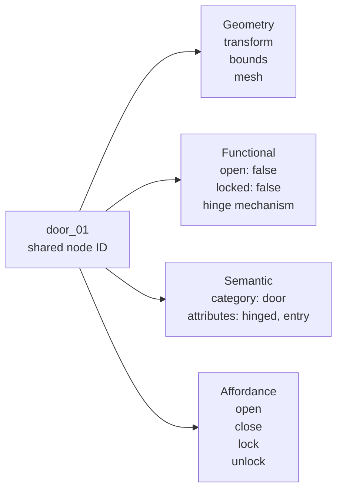
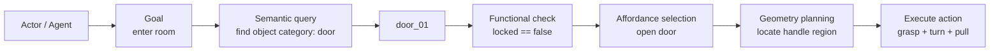
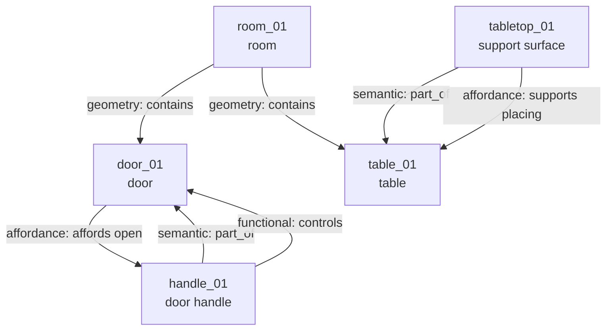
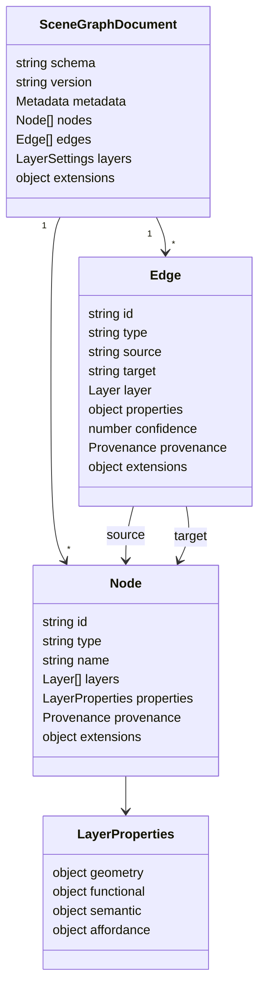

# Visualization

This page sketches the schema idea visually. The diagrams use Mermaid, which is
rendered by GitHub Markdown.

## Four-Layer Scene Graph

## One Object Across Multiple Views

## Cross-Layer Reasoning Example

## Example Room Graph

## Conceptual Data Model

